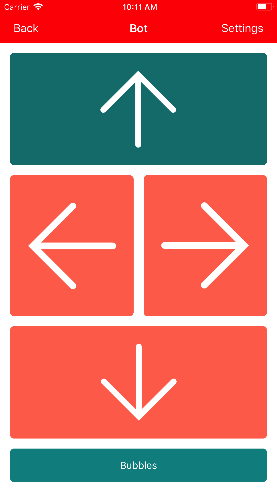

# ButtonBot

ButtonBot allows two popular robot toys to be controlled using a single bluetooth access switch. It allows switch users to move beyond simple cause and effect allowing them to participate in a whole range of games and activities by controlling their robot.

ButtonBot supports the MBot from MakeBlock. We hope to add support for more toy robots in the future.

To use the app connect a bluetooth access switch (such as the Pretorian iSwitch) to your iOS device. The switch should be configured to send the enter command when pressed. Open the app and connect to the robot. The app will auto-scan between the different directions with a switch press causing the robot to drive in that direction.

Add a second access switch, configured to send the space command, to access the action button which will activate a servo motor connected to the MBot.

ButtonBot was originally created for twins Ayala and Caira as part of the BBC TV program ‘The Big Life Fix’.

## Requirements

* [Xcode](https://developer.apple.com/xcode/download/)
* [Cocoapods](https://cocoapods.org/)

## Screenshots

## Installation Instructions

1. Download the [source code](https://github.com/akramhussein/ButtonBot)

  `$ git clone git@github.com:akramhussein/ButtonBot.git`

2. Install [cocoapods](https://cocoapods.org/)

  `$ cd ./ButtonBot && pod install`

3. Open "ButtonBot.xcworkspace" in Xcode

4. Open Xcode's Preferences > Accounts and add your Apple ID

5. In Xcode's sidebar select "ButtonBot" and go to Targets > ButtonBot > General > Identity and add a word to the end of the Bundle Identifier to make it unique. Also select your Apple ID in Signing > Team

6. Connect your iPad or iPhone and select it in Xcode's Product menu > Destination

7. Press CMD+R or Product > Run to install ButtonBot

## License

ButtonBot is available under the MIT License
